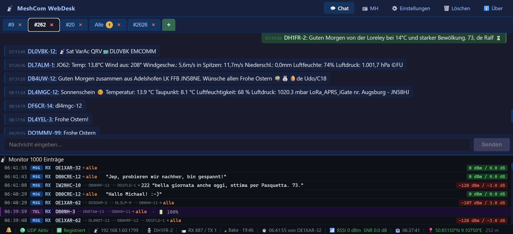

# MeshCom Web Client

A **Blazor Server** web application for communicating with a [MeshCom 4.0](https://icssw.org/meshcom/) node via UDP (EXTUDP JSON protocol).  
Built with **.NET 10** and **Blazor Interactive Server**.

> **MeshCom Firmware:** Compatible with [icssw-org/MeshCom-Firmware](https://github.com/icssw-org/MeshCom-Firmware) v4.35+

---

## Screenshots

> Place a screenshot as `docs/screenshot.png` and it will appear here.



---

## Features

### 💬 Chat
- **Multi-tab conversations** – each partner (callsign, group, broadcast) gets its own tab
- **Broadcast tab „Alle"** for `*` / `CQCQCQ` messages
- **Direct messages** – each callsign gets its own tab automatically
- **Group messages** – group destinations appear as `#<group>` tabs with optional whitelist filter
- Smart routing: broadcast replies from a known callsign appear in their direct tab
- **Auto-scroll** to the latest message when a tab is opened or a new message arrives
- **Unread badge** – inactive tabs show a yellow counter badge for new messages
- **ACK delivery indicator** on every outgoing message:
  - `⏳` grey – waiting for node echo (message queued)
  - `✓` blue – node has transmitted over LoRa (sequence number assigned)
  - `✓✓` green – recipient confirmed delivery (APRS ACK received)

### 📻 MH – Most Recently Heard
- Live table of all heard stations with last message, timestamp and message count
- **GPS position** parsed from EXTUDP position packets (`lat_dir` / `long_dir` APRS format)
- **Distance calculation** (Haversine) from own position to each heard station
- **RSSI / SNR** signal quality with colour coding (green / yellow / red)
- Altitude correctly converted from APRS feet to metres
- 🗺️ OpenStreetMap link per station
- Own position extracted automatically from the node's `type:"pos"` UDP beacon
- **Browser GPS** button to use device geolocation as own position

### 📡 Monitor (lower pane)
- Structured display with type badge (`MSG` / `POS` / `ACK` / `SYS`), direction (`RX` / `TX`), routing and signal
- Colour-coded rows: green left border for TX, cyan for position beacons, gold for ACKs
- Newest entry always at the top; configurable history limit (`MonitorMaxMessages`)
- Collapsible on mobile (toggle button)

### 📊 Status bar
- UDP socket state (🟢 Aktiv / 🔴 Inaktiv) and registration status
- Last RX timestamp, sender callsign, RSSI / SNR with colour coding
- TX counter, own callsign, device IP:Port
- Own GPS position with source label (Node / Browser GPS)

### 💾 State Persistence
- Chat tabs, MH list, monitor history and **own GPS position** are saved to disk on shutdown
- State is restored automatically on startup – no waiting for the first position beacon
- Auto-save every 5 minutes; data stored in `DataPath` (configurable)

### 🌐 Navigation
- Top navigation bar: **Chat** · **📻 MH** · **ℹ️ Über**
- About page with build timestamp (embedded at compile time)

### 📝 Logging (Serilog)
- Rolling daily log files with configurable retention
- Optional UDP traffic log (`LogUdpTraffic`) for offline analysis

---

## Architecture

```
MeshcomWebClient/              ← Blazor Server (ASP.NET Core host)
│  Program.cs                  ← DI setup, Serilog, hosted services
│  appsettings.json            ← All configuration
│
├─ Components/
│  ├─ App.razor                ← HTML shell + JS helpers (scrollToBottom)
│  ├─ Layout/
│  │    MainLayout.razor       ← Top navigation bar
│  └─ Pages/
│       Chat.razor             ← Chat tabs + monitor pane + status bar
│       Mh.razor               ← Most Recently Heard table + own position
│       About.razor            ← Copyright / build info
│       Clear.razor            ← Data reset page
│
├─ Helpers/
│     GeoHelper.cs             ← Haversine, coordinate formatting, OSM links
│
├─ Models/
│     MeshcomMessage.cs        ← Message model (from/to/text/GPS/RSSI/SequenceNumber/IsAcknowledged)
│     MeshcomSettings.cs       ← Strongly-typed config (IOptions)
│     ChatTab.cs               ← Tab model with UnreadCount
│     HeardStation.cs          ← MH list entry with GPS + signal data
│     ConnectionStatus.cs      ← Live UDP status + own GPS position
│     PersistenceSnapshot.cs   ← Serialisable state snapshot (tabs, MH, monitor, own GPS)
│
└─ Services/
      MeshcomUdpService.cs     ← BackgroundService: UDP RX/TX, GPS parsing, ACK matching
      ChatService.cs           ← Singleton: routing, tabs, MH list, monitor, ACK tracking
      DataPersistenceService.cs← BackgroundService: load/save state to JSON on disk
```

---

## Configuration

All settings in `MeshcomWebClient/appsettings.json`:

```json
"Meshcom": {
  "ListenIp":           "0.0.0.0",       // bind address (0.0.0.0 = all interfaces)
  "ListenPort":         1799,            // local UDP port
  "DeviceIp":           "192.168.1.60",  // MeshCom node IP
  "DevicePort":         1799,            // MeshCom node UDP port
  "MyCallsign":         "DH1FR-2",       // own callsign
  "LogPath":            "C:\\Temp\\Logs",// log file directory
  "LogRetainDays":      30,              // log file retention in days
  "LogUdpTraffic":      false,           // log every UDP packet to file
  "MonitorMaxMessages": 1000,            // max monitor history (oldest dropped)
  "GroupFilterEnabled": false,           // only show whitelisted group tabs
  "Groups":             ["#262"],        // whitelisted groups (GroupFilterEnabled=true)
  "DataPath":           "C:\\Temp\\MeshcomData" // persistent state directory
}
```

### LAN access (iPad / mobile)

The `lan` launch profile binds to all network interfaces:

```powershell
# In Visual Studio: select profile "lan" next to the Run button
# Then open in browser on any device in the same network:
http://192.168.x.x:5162
```

### UDP traffic logging

Set `"LogUdpTraffic": true` to write every packet to the log file:

```
[INF] [UDP-RX] 192.168.1.60:1799 {"src_type":"lora","type":"msg","src":"DH1FR-1",...}
[INF] [UDP-TX] 192.168.1.60:1799 {"type":"msg","dst":"DH1FR-1","msg":"Hello"}
```

Filter the log file:
```powershell
Select-String "\[UDP-RX\]" C:\Temp\Logs\MeshcomWebClient-*.log
Select-String "\[UDP-TX\]" C:\Temp\Logs\MeshcomWebClient-*.log
```

---

## EXTUDP Protocol

This client communicates with the MeshCom node using the **EXTUDP JSON protocol** defined in the [MeshCom firmware](https://github.com/icssw-org/MeshCom-Firmware).

| Direction | Format |
|-----------|--------|
| Registration | `{"type":"info","src":"DH1FR-2","dst":"*","msg":"info"}` |
| Chat RX | `{"src_type":"lora","type":"msg","src":"DH1FR-1","dst":"DH1FR-2","msg":"Hello{034","rssi":-95,"snr":12,...}` |
| Position RX | `{"src_type":"node","type":"pos","src":"DH1FR-2","lat":50.8515,"lat_dir":"N","long":9.1075,"long_dir":"E","alt":827,...}` |
| Chat TX | `{"type":"msg","dst":"DH1FR-1","msg":"Hello"}` |
| ACK RX | `{"src_type":"lora","type":"msg","src":"DH1FR-1","dst":"DH1FR-2","msg":"DH1FR-2  :ack034"}` |

**ACK delivery tracking:**
1. Outgoing message is sent → `⏳` pending
2. Node echo arrives with sequence marker `{034}` → sequence number is stored, indicator changes to `✓`
3. Recipient sends APRS ACK `:ack034` → message is marked as delivered `✓✓`

> **Note:** Altitude in position packets follows APRS convention (feet). The client converts to metres automatically.

---

## Requirements

- [.NET 10 SDK](https://dotnet.microsoft.com/download/dotnet/10.0)
- A reachable MeshCom node running firmware [v4.35+](https://github.com/icssw-org/MeshCom-Firmware/releases) with EXTUDP enabled
- UDP port 1799 open (Windows Firewall / router)

---

## Build & Run

```powershell
cd MeshcomWebClient
dotnet run --launch-profile lan    # accessible from all devices
# or
dotnet run                         # localhost only
```

Then open `http://localhost:5162` (or `http://<your-ip>:5162` for LAN access).

---

## 🐳 Docker – Deployment auf Linux

### Voraussetzungen

```bash
# Docker + Docker Compose Plugin installieren (Debian / Ubuntu / Raspberry Pi OS)
sudo apt-get update
sudo apt-get install -y docker.io docker-compose-plugin

# Aktuellen Benutzer zur docker-Gruppe hinzufügen (kein sudo nötig)
sudo usermod -aG docker $USER
newgrp docker
```

### Erstkonfiguration & Start

```bash
# Repository klonen
git clone https://github.com/DH1FR/MeshcomWebClient.git
cd MeshcomWebClient

# Optionale Konfigurationsdatei anlegen (überschreibt die eingebetteten Defaults)
cp deploy/appsettings.linux.json appsettings.json
nano appsettings.json          # DeviceIp, MyCallsign, Groups usw. anpassen

# Image bauen und Container starten
docker compose up -d --build
```

Der Container läuft danach im Hintergrund und startet automatisch neu (`restart: unless-stopped`).  
Web-Oberfläche: **http://\<Linux-IP\>:5162**

> **Hinweis:** `network_mode: host` ist zwingend erforderlich, damit der Container UDP-Pakete vom MeshCom-Gerät empfangen kann.

### Konfiguration anpassen

Entweder in `appsettings.json` (neben `docker-compose.yml`) oder direkt als Umgebungsvariablen in `docker-compose.yml`:

```yaml
environment:
  - Meshcom__DeviceIp=192.168.1.60
  - Meshcom__MyCallsign=DH1FR-2
  - Meshcom__GroupFilterEnabled=true
  - Meshcom__Groups__0=#OE
  - Meshcom__Groups__1=#Test
```

Nach jeder Änderung an `docker-compose.yml` oder `appsettings.json`:

```bash
docker compose up -d
```

---

### 🔄 Update nach Code-Änderungen

Neue Version aus dem Repository holen, Image neu bauen und Container ersetzen:

```bash
cd MeshcomWebClient

# Aktuelle Änderungen holen
git pull origin master

# Image neu bauen und Container ersetzen (kurze Downtime)
docker compose up -d --build

# Altes, nicht mehr verwendetes Image aufräumen (optional)
docker image prune -f
```

### Nützliche Docker-Befehle

```bash
# Status des Containers prüfen
docker compose ps

# Live-Logs anzeigen (Strg+C zum Beenden)
docker compose logs -f

# Container stoppen
docker compose stop

# Container stoppen und entfernen (Konfiguration & Logs bleiben erhalten)
docker compose down

# Container stoppen, entfernen und Image löschen (kompletter Reset)
docker compose down --rmi local
```

---

## License

MIT – see [LICENSE](LICENSE)

---

© by Ralf Altenbrand (DH1FR) 03/2026

---

## EXTUDP Protocol

| Direction | Format |
|-----------|--------|
| Registration | `{"type":"info","src":"DH1FR-2","dst":"*","msg":"info"}` |
| Receive (RX) | `{"src_type":"lora","type":"msg","src":"DH1FR-1","dst":"DH1FR-2","msg":"Hello{034",...}` |
| Send (TX)    | `{"type":"msg","dst":"DH1FR-1","msg":"Hello"}` |

---

## Requirements

- [.NET 10 SDK](https://dotnet.microsoft.com/download/dotnet/10.0)
- A reachable MeshCom node with EXTUDP enabled
- UDP port 1799 open on the host

---

## Build & Run

```powershell
cd MeshcomWebClient
dotnet run
```

Then open `https://localhost:5001` in your browser.

---

## License

MIT – see [LICENSE](LICENSE)
